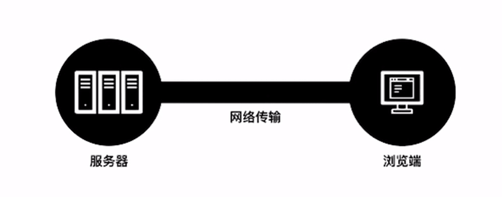

# 开启你的 Web 前端之旅

## 要求和准备

- 保证每周 10 ~ 15 个小时学习时间，并坚持独立完成项目
- 提前了解编程原理和互联网概念
- 准备好电脑和网络

## 专业导师的要求

- 能够主动地解决问题 ( 可以使用 [谷歌](https://www.google.com)， [github](https://github.com/)， [stackoverflow](https://stackoverflow.com/) )

- 学会提问（ 可以向导师，助教和学伴等提问 ）
- 学会总结（ 写博客，帮助其他人）

## 工程师的建议

- 多看书，形成完整的前端技术知识体系，**多动手实践**
- 跟随到牛，向大牛学习，让优秀成为一种习惯
- 遇到问题，不要急躁，要有耐心，不断坚持
- 学好英语

## 学习准则
- 保证每周 10 ~ 15 个小时的学习时间
- 保证按时提交项目
- 保证独立完成项目
- 保证以专业工程师的标准要求自己

## Web 技术的发展和历史

### 不断迭代的 Web 技术

- Web 技术的本质没有发生太大变化
- 工具化和工程化上有较大的改变

### Web 的历史

- Worl Wide Web , 万维网已经发展了 28 年
- Tim Berners Lee, 提出一整套 Web 设计方案

    

    - 服务器
    - 网络传输
        - HTTP 协议
            - 1989 , HTTP 0.9
            - 1996 , HTTP 1.0 (RFC1945）
            - 1999 , HTTP 1.1 (RFC2616)
            - 2015 , HTTP 2 (RFC7540）
    - 浏览器
        - HTML
            - 最新版本 HTML5
        - CSS
            - CSS2
            - CSS3
        - JavaScript
            - ES5
            - ES6
            - ES7
        - Node.js

- 发展过程中的两个重要节点
    - 免费
    - 标准， W3C 组织
- 到现在， Web 技术在不断的走向标准化，场景化和工程化

#### 相关资源推荐

- 文章
    - [非计算机专业出身的我是如何在两年内成长为前端工程师的](https://zhuanlan.zhihu.com/p/23272560)
    - [Come on Baby! 你也可以成为Web开发工程师！——Web开发工程师完全成长指南](https://zhuanlan.zhihu.com/p/22978846?refer=icode)
    - [自学前端开发：代码之外需要关注的问题](https://zhuanlan.zhihu.com/p/23629993)

- 网站
    - [MDN](https://developer.mozilla.org/zh-CN/)
    - [Smashing Magazine](https://www.smashingmagazine.com/)
    - [CSS Tricks](https://css-tricks.com/)
    - [Sitepoint](http://www.sitepoint.com/)
    - [Javascript weekly](http://javascriptweekly.com/)
    - [CSS weekly](http://css-weekly.com/)
    - [博客园](http://www.cnblogs.com/)
