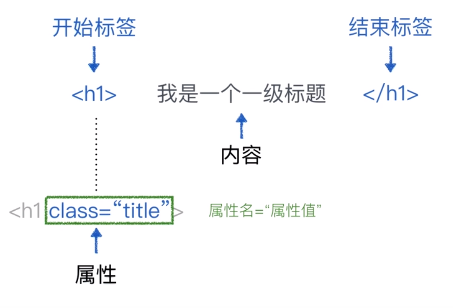

# HTML 元素

## HTML 元素
### 什么是元素
- 类似 `<tag>......</tag>` 这样成对出现的结构，就可以称之为**元素**

### 元素的结构


- **注意**
    - 一般情况下，开始标签和结束标签成对出现
    - 但是，也存在单标签元素，例如 ``

## HTML 注释
- 注释格式
    ```HTML
    <!-- 这就是 html 注释 -->
    ```
