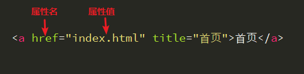

# HTML 属性



## 属性特征
- 每个属性之间或与元素名之间都有一个空格隔开
- 属性名后面紧跟等号
- 属性值使用双引号包裹

> **注意**:
> - 有一些属性只有属性名，没有属性值，称之为 **布尔属性**。如`<input type="text" disabled>`
> - 可以自定义属性存储数据，使用 [HTML data-* 属性](http://www.w3school.com.cn/tags/att_global_data.asp)

## 属性分类
- 可以用于每个元素的全局属性，如 `class` 属性
- 可用于某一类元素的，如 form 表单相关元素的 `name`、`value` 属性
- 只用于某一个元素的，如 `alt` 属性只用于 `img`元素

### 全局属性

#### class
- 作用
    - 用来设置元素的一个或多个类名
- 特点
    - 类名不能以数字开头（一定要牢记）
    - 类名可以设置多个值，以空格分开，如`<div class="box box--menu"></div>`
    - 不同的元素可以有相同的类名
- 示例

    ```HTML
    <p class="p1 blue"></p>
    <div class="red"></div>
    ```

#### id
- 作用
    - 设置元素的唯一性，经常用于 JS 操作或 CSS 操作，也可用作定义锚点
- 特点
    - 在整个 HTML 文档中必须是唯一的
    - 不可以和 class 那样设置多个值
- 示例

    ```HTML
    <p id="test"></p>
    <div id="red"></div>
    ```

#### title
- 作用
    - 用来设置元素的额外信息，鼠标滑过元素暂停一会会显示 title 属性的内容。
- 示例

    ```HTML
    <a title="全部的链接文字" href="#">链接文字很多...</a>
    ```
#### style
- 作用
    - 用于设置元素的行内样式，一般用于 JS 动态改变元素的样式。
- 示例

    ```HTML
    <div style="display: none;">我是隐藏的区域，可以通过JS来切换显示</div>
<p style="width: 500px;">设置宽度为500px</p>
    ```

### 参考链接
- [HTML 全局属性| W3chool](http://www.w3school.com.cn/tags/html_ref_standardattributes.asp)

- [HTML 全局属性| MDN](https://developer.mozilla.org/zh-CN/docs/Web/HTML/Global_attributes)

- [HTML 属性参考](https://developer.mozilla.org/zh-CN/docs/Web/HTML/Attributes)
