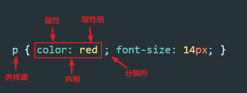

# CSS 基础

## 认识 CSS
- Cascading Style Sheets, 层叠样式表

## CSS 语法



```CSS
p {
  color: white;
  font-size: 16px;
  background-color: red;
  width: 200px;
}
```

## CSS 注释

### 辅助阅读注释
```CSS
/* logo 样式  */
.logo {
  width: 200px; /* 宽度 200px */
}
```

### 单行代码注释

```CSS
/* logo 样式 */
.logo {
 /* width: 200px; */
}
```

### 多行代码注释

```CSS
/* logo 样式 */
.logo {
    width: 200px;
    /* height: 100px;
    position: relative;
    left: 10px;
    top: 40px; */
}
```

## HTML 中引入 CSS
### 行内样式(不推荐)
- 通过给元素添加 `style` 属性来添加样式

  ```HTML
  <!DOCTYPE html>
  <html>
    <head>
      <meta charset="utf-8">
      <title>CSS 学习</title>
    </head>
    <body>
      <h1 style="color:red;">我是一个红色的标题</h1>
      <p style="color:red;">我是一个段落文字</p>
    </body>
  </html>

  ```
- 缺点
  - 样式和结构混在一起，代码难以维护
  - 冗余

### 内嵌样式（不推荐）
- 通过在 `<head>` 元素中使用 `<style>` 元素来定义

  ```HTML
  <!DOCTYPE html>
  <html>
    <head>
      <meta charset="utf-8">
      <title>CSS 学习</title>
      <style type="text/css">
          div {
            color:red;
          }
      </style>
    </head>
    <body>
      <div>
        <h1>我是一个红色的标题</h1>
        <p>我是一个段落文字</p>
      </div>  
    </body>
  </html>
  ```
- 缺点
  - 冗余

### 外链方式
- 通过在 `<head>` 元素中使用 `<link>` 元素来引入

  ```HTML
  <head>
      <link rel="stylesheet" type="text/css" href="style.css">
  </head>
  ```
- 优点
  - 最推荐的引入 CSS 的方式
  - 具备良好的可维护性
  - 改善页面加载速度

### 导入方式
- 使用 `@import` 方式导入 CSS，这种方式**建议只作为一个了解，千万不要使用**

  ```HTML
  <style>
      @import url(style.css);
  </style>
  ```
- 与外链方式比较
  - 范畴不同： `<link>` 属于 HTML 元素，通过其`href`属性来引入外部文件；而 `@import` 属于 CSS，所以导入语句应写在 CSS 中，要注意的是导入语句应写在样式表的开头，否则无法正确导入外部文件
  - 兼容性差别： `@import` 是 CSS2.1 才出现的概念，所以如果浏览器版本较低，无法正确导入外部样式文件；而`<link>`则没有任何兼容问题；
  - 加载顺序不同：当 HTML 文件被加载时，`<link>`引用的文件会同时被加载，而 `@import`引用的文件则会等页面全部下载完毕再被加载
  - js 修改支持：`<link>`支持使用 JavaScript 控制DOM改变CSS样式，`@import`不支持

### 总结
应尽量使用 <link> 标签导入外部 CSS 文件，避免或者少使用其他三种方式。
