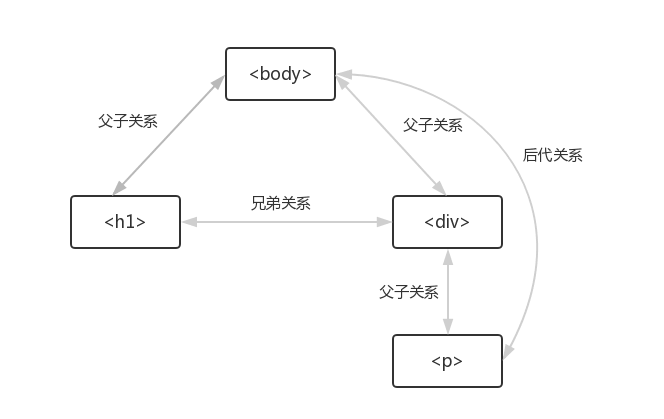
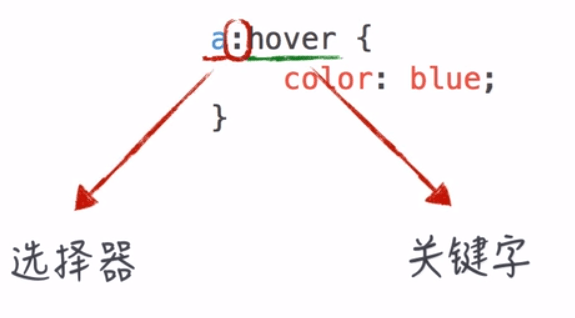
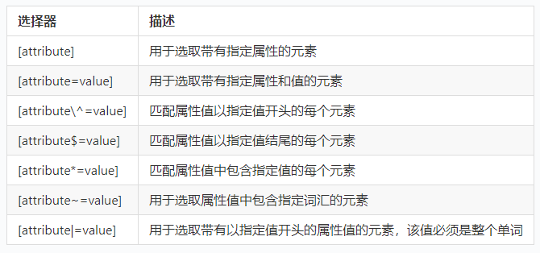

# CSS 选择器

## 概述
- 选择器
  - 选中需要添加样式的元素

## 基础选择器

### 元素选择器

```CSS
p {
  color: red;
}
```

### ID 选择器
- 取值全局唯一

```HTML
<!DOCTYPE html>
<html>
  <head>
    <meta charset="utf-8">
    <title>ID 选择器</title>
    <style media="screen">
        #green {
          color: green;
        }
    </style>
  </head>
  <body>
    <p id="green">这是一段测试文字</p>
  </body>
</html>
```

### 类选择器
- 应用于多个元素
- 组合使用

```HTML
<!DOCTYPE html>
<html>
  <head>
    <meta charset="utf-8">
    <title>ID 选择器</title>
    <style media="screen">
        .fs {
          font-size: 14px;
        }

        .blue {
          color: blue;
        }
    </style>
  </head>
  <body>
    <p class="fs">这是一段测试文字</p>
    <p class="fs">这是一段测试文字</p>
    <p class="fs blue">这是一段测试文字</p>
  </body>
</html>
```

### 通用选择器

```HTML
<!DOCTYPE html>
<html>
  <head>
    <meta charset="utf-8">
    <title>ID 选择器</title>
    <style media="screen">
        /* 通用选择器 */
        * {
          font-size: 14px;
        }
    </style>
  </head>
  <body>
    <p class="fs">这是一段测试文字</p>
    <p class="fs">这是一段测试文字</p>
    <p class="fs blue">这是一段测试文字</p>
  </body>
</html>
```

### 选择器分组
- 使用选择器分组简化和复用 CSS 代码

- 没有分组之前

  ```CSS
  h1 {
    color: #333;
    font-family: "微软雅黑";
    line-height: 2;
  }

  div {
    color: #333;
    font-family: "微软雅黑";
    width: 1200px;
  }

  span {
    color: #333;
    font-family: "微软雅黑";
    padding-left: 5px;
    padding-right: 5px;
  }
  ```

- 分组之后

  ```CSS
  h1,div,span {
    color: #333;
    font-family: "微软雅黑";
  }

  h1 {
    line-height: 2;
  }

  div {
    width: 1200px;
  }

  span {
    padding-left: 5px;
  }

  ```

## 关系选择器



```HTML
<div class="block">
    <p>第一个 P 元素</p>
    <div class="bd">
      <p>第二个 P 元素</p>
    </div>
    <div class="ft">

    </div>
</div>
<p>第三个 P 元素</p>

```

### 后代选择器

```CSS
.block p {
  color: green;
}

```

### 子元素

```CSS
.block  > p {
  color: blue;
}

```
### 后面的兄弟

```CSS
p ~ div {
  width: 200px;
}

```

### 紧跟其后的一个兄弟

```CSS
p + div {
  width: 300px;
}

```

## 伪类选择器



### 状态性伪类
- `:link` 设置 a 元素在未被访问的 CSS 样式
- `:visited` 设置 a 元素在其链接地址已被访问过时的 CSS 样式
- `:hover` 设置元素在其鼠标悬停时的 CSS 样式
- `:active` 设置元素在被用户激活（在鼠标点击与释放之间发生的事件）时的 CSS 样式

### 结构性伪类

```HTML
<ul class="list">
    <li class="item">HTML</li>
    <li class="item">CSS</li>
    <li class="item">Javascript</li>
    <li class="item">Sass</li>
    <li class="item">Less</li>
    <li class="item">Node.js</li>
</ul>

```

- `.item: first-child`
- `.item: nth-child(n)`
  - n 可以是数字（4）、关键词 ( odd, even) 或公式 （2n + 1）
- `.item: nth-last-child(n)`
- `.item: last-child`

## 伪元素选择器
- `::first-letter`: 第一个字
- `::first-line`: 第一行
- `::before`: 内容之前插入一个元素
- `::after`: 内容之后插入一个元素

## 属性选择器



## 选择器参考手册
- W3school
  - [CSS 选择器](http://www.w3school.com.cn/css/css_selector_type.asp)
  - [CSS 类选择器详解](http://www.w3school.com.cn/css/css_selector_class.asp)
  - [CSS ID 选择器详解](http://www.w3school.com.cn/css/css_selector_id.asp)
  - [CSS 属性选择器详解](http://www.w3school.com.cn/css/css_selector_attribute.asp)
  - [CSS 后代选择器](http://www.w3school.com.cn/css/css_selector_descendant.asp)
  - [CSS 子元素选择器](http://www.w3school.com.cn/css/css_selector_child.asp)
  - [CSS 相邻兄弟选择器](http://www.w3school.com.cn/css/css_selector_adjacent_sibling.asp)
  - [CSS 伪类](http://www.w3school.com.cn/css/css_pseudo_classes.asp)
  - [CSS 伪元素](http://www.w3school.com.cn/css/css_pseudo_elements.asp)

- 选择器参考手册
  - [选择器参考手册 | MDN](https://developer.mozilla.org/zh-CN/docs/Web/CSS/CSS_Selectors)
  - [CSS 选择器](http://www.runoob.com/cssref/css-selectors.html)
  - [CSS 选择器参考手册](http://www.w3school.com.cn/cssref/css_selectors.asp)
  - [Selectors Level 3 | W3](https://www.w3.org/TR/selectors/#selectors)
  - [Selectors Level 4 | W3](https://drafts.csswg.org/selectors-4/)

## 选择器优化
### 选择器效率
- 网站效率专家 Steve Souders 提出，各种 CSS 选择器的效率由高至低排序如下
  - id选择器（`#myid`）
  - 类选择器（`.myclassname`）
  - 标签选择器（`div,h1,p`）
  - 相邻选择器（`h1 + p`）
  - 子选择器（`ul > li`）
  - 后代选择器（`li a`）
  - 通配符选择器（`*`)
  - 属性选择器（`a[rel="external"`]）
  - 伪类选择器（`a:hover,li:nth-child`）

### 选择器解读顺序
- 对于关系选择器来说，我们的阅读习惯是从左到右，但是浏览器解读选择器，遵循的原则是从选择器的右边到左边读取。
- 如果路径链越短，效率也就相应有所提高。建议选择器的层级最多不要超过4层。
- 参考资料
  - [如何提升 CSS 选择器性能](https://www.jianshu.com/p/268c7f3dd7a6)
  - [CSS选择器的优化](https://www.w3cplus.com/css/css-selector-performance)
  - [Efficiently Rendering CSS(https://css-tricks.com/efficiently-rendering-css/)


#### 参考链接

- [学习 Web 开发](https://developer.mozilla.org/zh-CN/docs/learn)
- [content](https://developer.mozilla.org/zh-CN/docs/Web/CSS/content)
