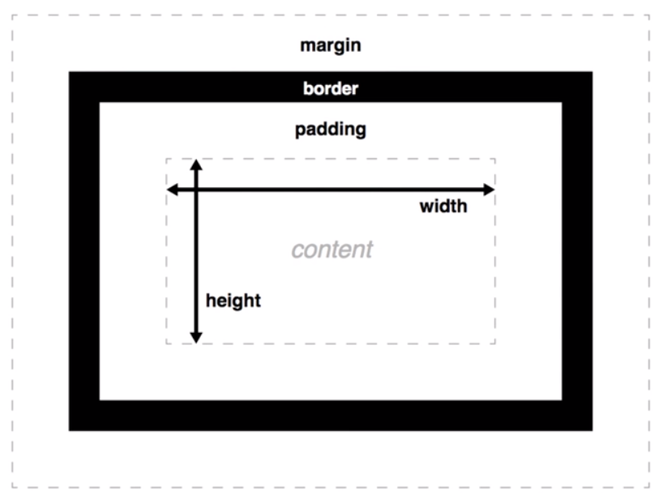

# CSS 盒子

## CSS 盒模型

- 内容区域
- 内边距
- 边框
- 外边距

### 盒模型相关属性

- 上,右，下，左
  - top
  - right
  - bottom
  - left

- margin
- border
- padding

## 元素的显示和隐藏

- `display`
  - 所有的后代元素都隐藏
  - 元素就像不存在一样

- `visibility`
  - 元素的大小不变，可理解透明
  - 子元素设为 `visibility: visible`，则该子元素依然可见

- `overflow`
  - 规定了当内容元素溢出父容器时的展现方式
  - 裁剪内容，使用滚动条来显示或直接显示超出部分
