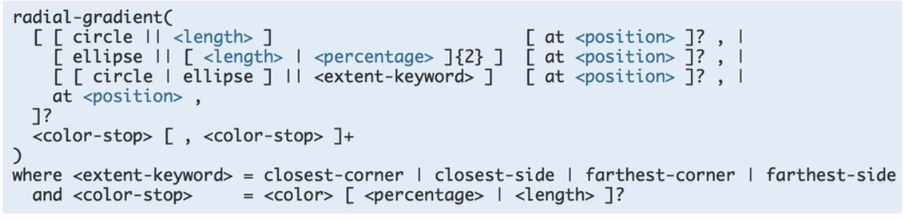

# CSS 背景

## 相关属性

- background-color: 背景颜色
- background-image: 背景图片
- background-repeat: 背景图片平铺方式
- background-position: 背景图片定位
- background-size: 背景图片大小
- background: 背景简写

## 图片

### 介绍

一般来说，有以下两种方式来使用图片：
- 通过 img 元素直接使用
  - 具有实际含义（如产品图片，相册图片等）
- 通过 background-image（背景图片）的形式使用
  - 一般用于装饰效果

### 初步了解

- jpg/jpeg：由于其色彩还原度比较好，所以一般色彩丰富的图片均采用该格式，如宣传图、产品图、相册图等等。（其实我们相机拍出来的照片就是该格式的）
- png：由于其对透明度的良好支持，所以一般用于透明图片，如 logo 图、图标图等
- gif：由于其对动画的支持，所以一般用来实现动效图片，如 loading 加载动画、一些搞笑图片等
- ico 格式属于图标文件，主要用于网址前面的标识图标
- webp 格式是由 google 研发的图片格式，它既具备高压缩率，又具备透明度以及动画的特性。目前各个大互联网公司都有在使用该格式，其带来的效果也非常显著。但是该格式有个明显的缺陷：目前浏览器端只有 google 浏览器支持。

#### 参考资料
- [JPEG 图像](http://www.w3school.com.cn/media/media_jpeg.asp)
- [GIF 图像](http://www.w3school.com.cn/media/media_gif.asp)
- [PNG 图像](https://baike.baidu.com/item/PNG)
- [ebP相对于PNG、JPG有什么优势](https://www.zhihu.com/question/27201061)

### 图片优化

通过HTTP Archieve统计显示，图片内容已经占到了互联网内容总量的65%左右。占用了很多流量及时间，所以从性能优化的角度看，图片绝对是优化的热点和重点之一。

- [Web性能优化：图片优化](http://web.jobbole.com/81766/)
- [前端图片优化机制](http://imweb.io/topic/568b20194c44bcc56092e415)
- [图像优化](https://developers.google.com/web/fundamentals/performance/optimizing-content-efficiency/image-optimization?hl=zh-cn)

## 雪碧图

### HTML 代码

```html
<!DOCTYPE html>
<html>
<head>
	<meta charset="UTF-8">
	<title>使用背景图片</title>
</head>
<body>
	<ul class="share-list">
		<li class="share-item item--qq" title="分享到qq"></li>
		<li class="share-item item--zone" title="分享到空间"></li>
		<li class="share-item item--wx" title="分享到微信"></li>
		<li class="share-item item--wb" title="分享到微博"></li>
	</ul>
</body>
</html>

```

### CSS 代码

```CSS

ul {
    list-style: none outside none;
    margin: 0;
    padding: 0;
}
.share-item {
  background: url(http://coding.imweb.io/img/p2/share-bg.png) no-repeat;
  display: inline-block;
  vertical-align: middle;
  height: 30px;
  width: 30px;
}
.item--qq {
  background-position: 0 0;
}
.item--zone {
  background-position: -30px 0;
}

/*
  已知每个图标宽高为30px，
  请根据上面qq图标和空间图标的样式，得出剩余个图标的样式
*/

.item--wx {
    /*设置微信图标的样式*/
    background-position: -60px 0;
}

.item--wb {
    /*设置微博图标的样式*/
    background-position: -90px 0;
}

```

## 渐变背景

### 线性

- 语法

```CSS

linear-gradient([<angle> | to <side-or-corner>],color-stop,...,color-stop);

repeat-linear-gradient([<angle> | to <side-or-corner>],color-stop,...,color-stop);

```

- 从上到下

```CSS
.gradient-default {
  background: linear-gradient(orange,yellow);
}

```

- 从左到右

```CSS
.gradient-utd {
  background: linear-gradient(to right, orange,yellow);
}

```

- 使用角度

```CSS
.gradient-angel {
  background: linear-gradient( 135deg,orange,yellow);
}

```

- 指定多个等间距的色标

```CSS
.gradient-colors{
  background: linear-gradient(to right,red,orange,yellow,white)
}

```

- 指定多个指定位置的色标

```CSS
.gradient-colorsposition {
  background: linear-gradient(to right, orange, yellow 70%, red);
}

```

- 使用透明度

```CSS
.gradient-opactity {
  background: linear-gradient(to right,rgba(0,0,255,0),rgba(0,0,255,1))
}

```

- 重复的线性渐变

```CSS
.gradient-repeat {
  background: repeating-linear-gradient(-45deg,blue,blue 5px,white 5px,white 10px)
}

```

### 径向

- 语法

 

- 等间距色标

```CSS
.gradient-equal {
  background: radial-gradient(red,yellow, rgb(30,144,255));
}

```

- 指定间距色标

```CSS
.gradient-colorsposition {
  background: radial-gradient(red 5%,yellow 15%, rgb(30,144,255) 60%);
}

```

- 指定中心点位置

```CSS
.gradient-position {
  background: radial-gradient(at 30px 30pxx,red 5%,yellow 15%, rgb(30,144,255) 60%);
}

```

- 指定渐变的形状 ( shape )

```CSS
.gradient-shape1 {
  background: radial-gradient(circle,red,orange,yellow);
}

.gradient-shape2 {
  background: radial-gradient(red,orange,yellow);
}

```

- 指定渐变的尺寸（size）

```CSS
.gradient-size1 {
  background: radial-gradient(circle closest-side,red,orange,yellow);
}

.gradient-size2 {
  background: radial-gradient(circle farthest-side,red,orange,yellow);
}

.gradient-size3 {
  background: radial-gradient(circle closest-corner,red,orange,yellow);
}

.gradient-size4 {
  background: radial-gradient(circle farthest-corner,red,orange,yellow);
}

```

- 重复的径向渐变

```CSS
.gradient-repeat {
  background: repeating-radial-gradient(red,orange 20%,yellow 25%);
}

```
