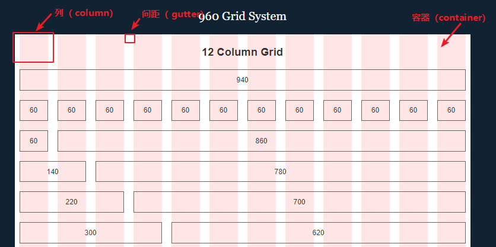

# float

## float

- 作用
  - 设置元素的浮动
- 属性值
  - none
    - 不浮动
  - left
    - 左浮动
  - right
    - 右浮动
- 影响
  - 父元素塌陷

## 清除浮动
### 解决问题
- 解决由于浮动元素脱离文流导致的元素重叠或者父元素高度坍塌的问题

#### 清除前面兄弟元素浮动

```html
<!DOCTYPE html>
<html lang="en">

<head>
    <meta charset="UTF-8">
    <title>清除浮动操作</title>
    <style>
    .fl {
        float: left;
    }

    .fr {
        float: right;
    }

    .cb {
        clear: both;
    }
    </style>
</head>

<body>
    <div class="fl">我是左浮动元素</div>
    <div class="fr">我是右浮动元素</div>
    <div class="cb">我不受浮动元素的影响</div>
</body>

</html>

```

#### 闭合子元素浮动（解决父元素高度坍塌）

- 问题描述
  - 在计算页面排版的时候，如果没有设置父元素的高度，那么该父元素的高度是由他的子元素高度撑开的。但是如果子元素是设置了浮动，脱离了文档流，那么父元素计算高度的时候就会忽略该子元素，甚至当所有子元素都是浮动的时候，就会出现父元素高度为 0 的情况，这就是所谓的父元素高度坍塌问题。为了能让父元素正确包裹子元素的高度，不发生坍塌，我们需要闭合子元素的浮动。

- 解决办法

  - 给最后一个元素设置 `clear: both`

    ```html
    <!DOCTYPE html>
    <html lang="en">

    <head>
        <meta charset="UTF-8">
        <title>清除浮动操作</title>
        <style>
        .box {
            float: left;
        }

        /* 第一种方法  在父元素末尾添加一个空元素 */
        .clear-box {
            clear: both;
        }

        /* 第二种方法 通过伪元素 ::after 实现 */
        .clearfix::after {
            content:"";
            display:table;
            clear: both;
        }
        </style>
    </head>

    <body>
        <div class="container">
            <div class="box"></div>
            <span class="clear-box"></span>
        </div>
        <div class="container clearfix">
          <div class="box"></div>
        </div>
    </body>

    </html>

    ```

  - 给父元素新建一个 BFC(块格式化上下文)
    - 原理：父元素在新建一个 BFC 时，其高度计算时会把浮动子元素的包进来
    - 创建 BFC 的情况
      - 根元素或其它包含它的元素
      - 浮动 (元素的 float 不是 none)
      - 绝对定位的元素 (元素具有 position 为 absolute 或 fixed)
      - 内联块 inline-blocks (元素具有 display: inline-block)
      - 表格单元格 (元素具有 display: table-cell，HTML表格单元格默认属性)
      - 表格标题 (元素具有 display: table-caption, HTML表格标题默认属性)
      - 块元素具有overflow ，且值不是 visible
      - display: flow-root

    ```HTML
    <!DOCTYPE html>
    <html lang="en">

    <head>
        <meta charset="UTF-8">
        <title>清除浮动操作</title>
        <style>
          .container {
              overflow: hidden;
          }
          .box {
              float: left;
          }
        </style>
    </head>

    <body>
      <div class="container">
        <div class="box"></div>
      </div
    </body>

    </html>
    ```

## float 布局

### 固定宽度居中布局

- HTML

```HTML
<!DOCTYPE html>
<html>

<head>
    <meta http-equiv="Content-Type" content="text/html; charset=UTF-8">
    <meta name="viewport" content="width=device-width, initial-scale=1.0">
    <meta http-equiv="X-UA-Compatible" content="ie=edge">
    <title>浮动布局——固定</title>
    <link rel="stylesheet" type="text/css" href="./reset.css">
    <link rel="stylesheet" type="text/css" href="./fixed.css">
</head>

<body style="" cz-shortcut-listen="true">
    <div class="page page--asides">
        <header class="header">
            <div class="center-inner">
                <h1>header区域</h1>
                <p>青，取之于蓝，而青于蓝；冰，水为之，而寒于水。</p>
            </div>
        </header>
        <div class="container">
            <div class="center-inner clearfix">
                <aside class="aside aside--left">
                    <section class="aside-block">
                        <h2>左边栏区域 1</h2>
                        <ul>
                            <li>君子博学而日参省乎己，则知明而行无过矣。</li>
                            <li>神莫大于化道，福莫长于无祸</li>
                            <li>故言有招祸也，行有招辱也，君子慎其所立乎！</li>
                        </ul>
                    </section>
                </aside>
                <!--aside_left-->
                <main class="main">
                    <div class="content">
                        <h2>内容区域</h2>
                        <article class="article">
                            <p>学恶乎始？恶乎终？曰：其数则始乎诵经，终乎读礼；其义则始乎为士，终乎为圣人， 真积力久则入，学至乎没而后止也。故学数有终，若其义则不可须臾舍也。为之，人也；舍 之，禽兽也。故书者，政事之纪也；诗者，中声之所止也；礼者，法之大分，类之纲纪也。故学至乎礼而止矣。夫是之谓道德之极。礼之敬文也，乐之中和也，诗书之博也，春秋之微 也，在天地之间者毕矣。君子之学也，入乎耳，着乎心，布乎四体，形乎动静。端而言，蝡而动，一可以为法则。小人之学也，入乎耳，出乎口；口耳之间，则四寸耳，曷足以美七尺之躯哉！古之学者为己，今之学者为人。君子之学也，以美其身；小人之学也，以为禽犊。故不问而告谓之傲，问一而告二谓之囋。傲、非也，囋、非也；君子如响矣。</p>
                            <p>积土成山，风雨兴焉；积水成渊，蛟龙生焉；积善成德，而神明自得，圣心备焉。故不积跬步，无以至千里；不积小流，无以成江海。骐骥一跃，不能十步；驽马十驾，功在不舍。锲而舍之，朽木不折；锲而不舍，金石可镂。蚓无爪牙之利，筋骨之强，上食埃土，下饮黄泉，用心一也。蟹六跪而二螯，非蛇鳝之穴无可寄托者，用心躁也。</p>
                        </article>
                    </div>
                </main>
                <!--main-->
                <aside class="aside aside--right">
                    <section class="aside-block">
                        <h2>右边栏区域 1</h2>
                        <ul>
                            <li>君子博学而日参省乎己，则知明而行无过矣。</li>
                            <li>神莫大于化道，福莫长于无祸</li>
                            <li>故言有招祸也，行有招辱也，君子慎其所立乎！</li>
                        </ul>
                    </section>
                </aside>
                <!--aside_right-->
            </div>
        </div>
        <!--container-->
        <footer class="footer">
            <div class="center-inner">
                <h2>footer区域</h2>
                <p>积土成山，风雨兴焉；积水成渊，蛟龙生焉；积善成德，而神明自得。</p>
            </div>
        </footer>
    </div>
</body>

</html>

```

- CSS

```CSS
@charset "utf-8";
h1,
h2,
h3 {
    font-weight: bold;
    margin-bottom: 10px;
}

.header {
    background-color: #ededed;
}

.footer {
    background-color: #E1DACF;
}

.container {
    background-color: #ccc;
}

.main {
    background-color: #fff;
}

.aside--right {
    background-color: #EFEFEF;
}

.center-inner {
    width: 1200px;
    margin-left: auto;
    margin-right: auto;
}

.header .center-inner,
.footer .center-inner {
    padding: 20px;
}

.main {
    width: 800px;
    padding: 20px;
    float: left;
}

.aside--right {
    width: 200px;
    padding: 20px;
    float: left;
}

.aside--left {
    width: 200px;
    padding: 20px;
    float: left;
}

.clearfix::after {
    content:"";
    display:table;
    clear: both;
}

```

### 内容流体布局

- HTML

```HTML
<!DOCTYPE html>
<html>

<head>
    <meta http-equiv="Content-Type" content="text/html; charset=UTF-8">
    <meta name="viewport" content="width=device-width, initial-scale=1.0">
    <meta http-equiv="X-UA-Compatible" content="ie=edge">
    <title>浮动布局——流体</title>
    <link rel="stylesheet" type="text/css" href="./reset.css">
    <link rel="stylesheet" type="text/css" href="./fluid.css">
</head>

<body style="" cz-shortcut-listen="true">
    <div class="page page--asides">
        <header class="header">
            <div class="center-inner">
                <h1>header区域</h1>
                <p>青，取之于蓝，而青于蓝；冰，水为之，而寒于水。</p>
            </div>
        </header>
        <div class="container">
            <div class="center-inner clearfix">
                <main class="main">
                    <div class="content">
                        <h2>内容区域</h2>
                        <article class="article">
                            <p>学恶乎始？恶乎终？曰：其数则始乎诵经，终乎读礼；其义则始乎为士，终乎为圣人， 真积力久则入，学至乎没而后止也。故学数有终，若其义则不可须臾舍也。为之，人也；舍 之，禽兽也。故书者，政事之纪也；诗者，中声之所止也；礼者，法之大分，类之纲纪也。故学至乎礼而止矣。夫是之谓道德之极。礼之敬文也，乐之中和也，诗书之博也，春秋之微 也，在天地之间者毕矣。君子之学也，入乎耳，着乎心，布乎四体，形乎动静。端而言，蝡而动，一可以为法则。小人之学也，入乎耳，出乎口；口耳之间，则四寸耳，曷足以美七尺之躯哉！古之学者为己，今之学者为人。君子之学也，以美其身；小人之学也，以为禽犊。故不问而告谓之傲，问一而告二谓之囋。傲、非也，囋、非也；君子如响矣。</p>
                            <p>积土成山，风雨兴焉；积水成渊，蛟龙生焉；积善成德，而神明自得，圣心备焉。故不积跬步，无以至千里；不积小流，无以成江海。骐骥一跃，不能十步；驽马十驾，功在不舍。锲而舍之，朽木不折；锲而不舍，金石可镂。蚓无爪牙之利，筋骨之强，上食埃土，下饮黄泉，用心一也。蟹六跪而二螯，非蛇鳝之穴无可寄托者，用心躁也。</p>
                        </article>
                    </div>
                </main>
                <!--main-->
                <aside class="aside aside--left">
                    <section class="aside-block">
                        <h2>左边栏区域 1</h2>
                        <ul>
                            <li>君子博学而日参省乎己，则知明而行无过矣。</li>
                            <li>神莫大于化道，福莫长于无祸</li>
                            <li>故言有招祸也，行有招辱也，君子慎其所立乎！</li>
                        </ul>
                    </section>
                </aside>
                <!--aside_left-->
                <aside class="aside aside--right">
                    <section class="aside-block">
                        <h2>右边栏区域 1</h2>
                        <ul>
                            <li>君子博学而日参省乎己，则知明而行无过矣。</li>
                            <li>神莫大于化道，福莫长于无祸</li>
                            <li>故言有招祸也，行有招辱也，君子慎其所立乎！</li>
                        </ul>
                    </section>
                </aside>
                <!--aside_right-->
            </div>
        </div>
        <!--container-->
        <footer class="footer">
            <div class="center-inner">
                <h2>footer区域</h2>
                <p>积土成山，风雨兴焉；积水成渊，蛟龙生焉；积善成德，而神明自得。</p>
            </div>
        </footer>
    </div>
</body>

</html>

```

- CSS

```CSS
@charset "utf-8";
h1,
h2,
h3 {
    font-weight: bold;
    margin-bottom: 10px;
}

.header {
    background-color: #ededed;
}

.footer {
    background-color: #E1DACF;
}

.content {
    background-color: #fff;
    padding: 20px;
}

.main {
    background-color: #fff;
}

.aside--right {
    background-color: #EFEFEF;
    padding: 20px;
}

.aside--left {
    background-color: #ccc;
    padding: 20px;
}

.center-inner {
    margin-left: auto;
    margin-right: auto;
}

.header .center-inner,
.footer .center-inner {
    padding: 20px;
}

.main {
    width: 100%;
    float: left;
}

.content {
    margin: 0 200px;
}

.aside--right {
    width: 200px;
    float: left;
    margin-left: -200px;
}

.aside--left {
    width: 200px;
    float: left;
    margin-left: -100%;
}

.clearfix::after {
    content: "";
    display: table;
    clear: both;
}

.article p {
    margin-bottom: 20px;
}

```

### 网格布局系统



- [960s 栅格布局](http://coding.imweb.io/demo/p3/960s/demo.html)
- [960 grid system 官网](https://960.gs/)


```HTML
<!-- 核心 html 代码 -->

<div class="container_12">
  <h2>
    12 Column Grid
  </h2>
  <div class="grid_12">
    <p>
      940
    </p>
  </div>
  <!-- end .grid_12 -->
  <div class="clear"></div>
  <div class="grid_1">
    <p>
      60
    </p>
  </div>
  <div class="grid_1">
    <p>
      60
    </p>
  </div>
  <div class="grid_1">
    <p>
      60
    </p>
  </div>
  <div class="grid_1">
    <p>
      60
    </p>
  </div>
  <div class="grid_1">
    <p>
      60
    </p>
  </div>
  <div class="grid_1">
    <p>
      60
    </p>
  </div>
  <div class="grid_1">
    <p>
      60
    </p>
  </div>
  <div class="grid_1">
    <p>
      60
    </p>
  </div>
  <div class="grid_1">
    <p>
      60
    </p>
  </div>
  <div class="grid_1">
    <p>
      60
    </p>
  </div>
  <div class="grid_1">
    <p>
      60
    </p>
  </div>
  <div class="grid_1">
    <p>
      60
    </p>
  </div>
  <!-- end .grid_1 -->
  <div class="clear"></div>
  <div class="grid_1">
    <p>
      60
    </p>
  </div>
  <!-- end .grid_1 -->
  <div class="grid_11">
    <p>
      860
    </p>
  </div>
  <!-- end .grid_11 -->
  <div class="clear"></div>
  <div class="grid_2">
    <p>
      140
    </p>
  </div>
  <!-- end .grid_2 -->
</div>

```

```CSS
/* 核心 CSS 代码 */

.container_12 .grid_12 {
    width: 940px;
}

.container_12 .grid_1 {
    width: 60px;
}

.grid_1, .grid_2, .grid_3, .grid_4, .grid_5, .grid_6, .grid_7, .grid_8, .grid_9, .grid_10, .grid_11, .grid_12, .grid_13, .grid_14, .grid_15, .grid_16 {
    display: inline;
    float: left;
    margin-left: 10px;
    margin-right: 10px;
}

```
