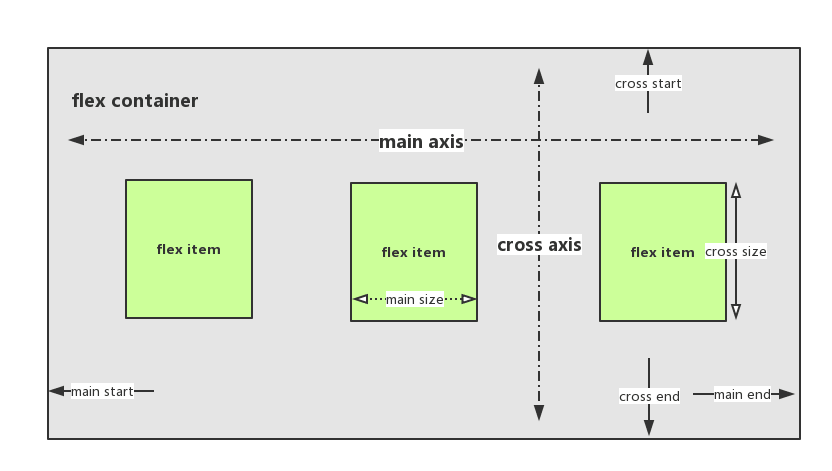

# flex 布局

## flexbox 基本概念

## flex container 相关属性

- flex-direction
  - 主轴的方向
- flex-wrap
  - 如果一条轴线排不下，如何换行
- flex-flow
  - flex-direction 和 flex-wrap 的简写
- justify-content
  - 主轴上的对齐方式
- align-items
  - 交叉抽的对齐方式
- align-content 
  - 多根轴线的对齐方式

- [参考链接](https://demos.scotch.io/visual-guide-to-css3-flexbox-flexbox-playground/demos/)

## flex item 相关属性

- order
  - 排列顺序
- flex-grow
  - 放大比例
- flex-shrink
  - 缩小比例
- flex-basis
  - item 所占主轴空间
- flex
  - flex-grow,flex-shrink,flex-basis 的简写
- align-self
  - 对齐方式，覆盖 align-items
