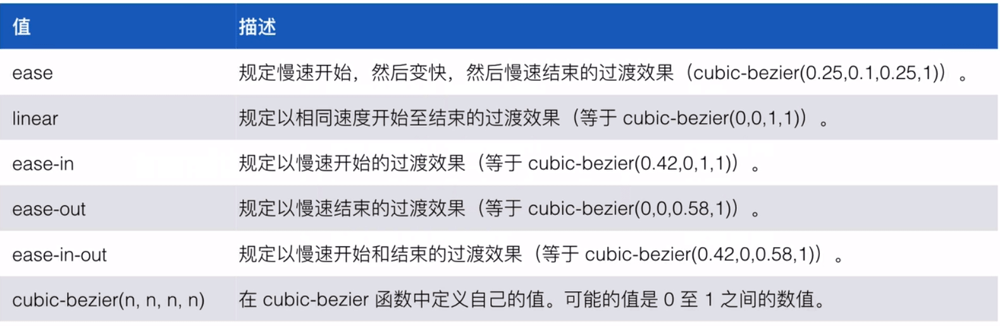

# CSS 动画

## 简介

- 补间动画
  - transition

- 帧动画
  - animation

## transition 动画

### transition
- transition-property
  - 属性
    - 不支持动画的一些属性
      - background-image: (a.png-->b.png)
      - float: (none--> left)
      - width/height: (auto-->10px)
      - display:(none-->block)
      - visibility: (hidden --> visible)
      - position: (static --> absolute)
- transition-duration
  - 持续时间
- transition-timing-function
  - 动效
- transition-delay
  - 延迟时间

### 缓动函数



- [缓动函数速查表](http://easings.net/zh-cn)
- [cubic-bezier](http://cubic-bezier.com/#.17,.67,.83,.67)

## animation 动画

### animation
- animation-name
  - 名称
- animation-duration
  - 持续时间
- animation-timing-function
  - 动效
- animation-delay
  - 延迟时间
- animation-iteration-count
  - 次数
- animation-direction
  - 方向
- animation-fill-mode
  - 动画开始与结束的帧样式
- animation-play-staus
  - 动画状态（暂停或运行）

```CSS

@keyframes circleRun {
    from {
      transform: translate(150px,70px);
    }
    33% {
      transform: translate(150px,75px);
    }
    66% {
      transform: translate(400px,-75px);
    }
    to {
      transform: translate(550px,0);
      background: red;
    }
}

.circle {
  width: 50px;
  height: 50px;
  border-radius: 50%;
  margin-top: 75px;
  background: blue;
  animation: circleRun 2s ease infinite;
}

```

## transition 动画和 animation 动画

- transition
  - 需要借助交互
    - ：hover,:active,:checked,:focus
    - add/remove class
  - 只能定义第一帧和最后一帧样式
- animation
  - 即可自动也可借助交互
  - 可以控制多帧
  - 可以控制暂停播放

## 常见的动画库

- [Animate.css](https://daneden.github.io/animate.css/)
- [Magic CSS3 Animation](https://www.minimamente.com/example/magic_animations/)
- [Hover CSS](http://ianlunn.github.io/Hover/)
- [Effeckt](http://h5bp.github.io/Effeckt.css/)
- [Single Element CSS Spinners](https://projects.lukehaas.me/css-loaders/)

注：一般不建议全部拿来使用，而是使用哪个动画效果就拷贝对应的样式。
